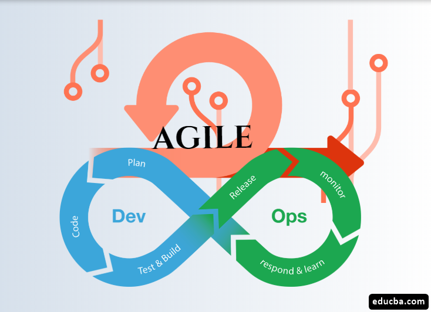

# tech201_agile_and_scrum

## How does agile fit into DevOps?

By putting  Agile practices into a DevOps workflow, teams can align development, testing, and deployment, allowing for faster delivery and increased adaptability to change. Both Agile and DevOps also emphasizes on continuous improvement, collaboration and communication across DevOps and testing teams.

 

## How does agile benefit a business?

    Faster time to market Agile development allows teams to deliver software in small, incremental chunks, getting new features and improvements to customers faster.

    Increased adaptability to change: Agile methodologies prioritize flexibility, which allows teams to respond quickly to changes in customer requirements or market conditions.

    Improved collaboration and communication: Agile methodologies encourage collaboration and communication among cross-functional teams, which can lead to better decision-making and problem-solving.

    Improved customer satisfaction:  Agile development allows teams to get feedback from customers early and often, 

    Increased efficiency: Agile methodologies emphasize continuous improvement, which can lead to more efficient processes and better use of resources.

    Better quality of products: Agile methodologies promote testing and

 
  

