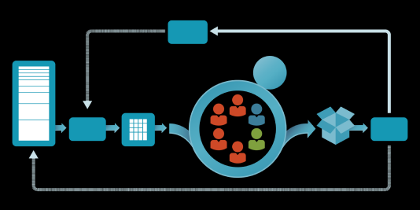
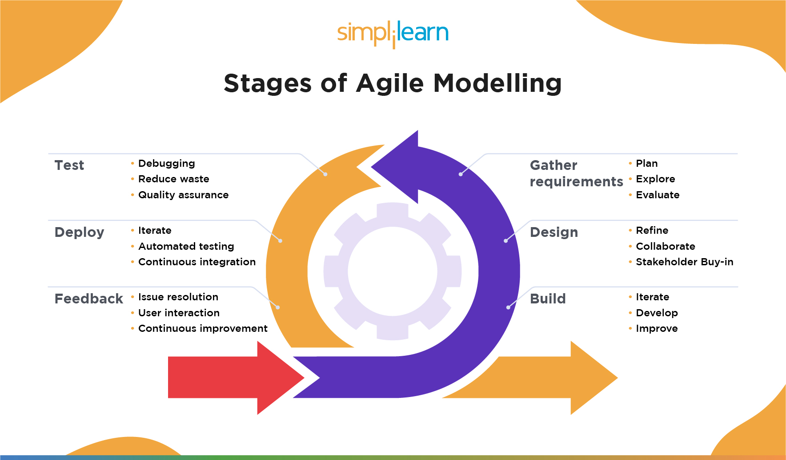

# tech201_agile_and_scrum

## What is agile?

Agile is a methodology for project management and software development that emphasizes flexibility, collaboration, and customer satisfaction. Agile methodologies are based on the Agile Manifesto, a set of values and principles that prioritize individuals and interactions, working software, and customer collaboration over processes and tools.

Agile methodologies are designed to be adaptive and responsive to change, allowing teams to quickly and efficiently deliver working software and continuously improve the process. This is in contrast to traditional, "waterfall" methodologies, which are more rigid and linear, with distinct phases of development that must be completed before moving on to the next.

Some popular Agile methodologies include Scrum, Kanban, Lean, and Extreme Programming (XP). These methodologies have different practices and ceremonies but share the same philosophy of Agile.
## How does agile fit into DevOps?

By putting  Agile practices into a DevOps workflow, teams can align development, testing, and deployment, allowing for faster delivery and increased adaptability to change. Both Agile and DevOps also emphasizes on continuous improvement, collaboration and communication across DevOps and testing teams.

 ## The Agile Workflow Explained

Discovery/Inception: This is the initial stage of the project where the team defines the problem or opportunity, conducts research, and creates a vision for the project. The goal is to understand the customer's needs and create a shared understanding of what needs to be built.

Planning: This stage includes creating a backlog of user stories and tasks, prioritizing them, and creating a plan for the upcoming sprint or iteration. This is when the team decides which items from the backlog will be worked on in the next sprint.

Development: This is the stage where the team works on the tasks and user stories they have planned. They use Agile practices such as pair programming, test-driven development, and continuous integration to build the product incrementally.

Review: At the end of each sprint or iteration, the team conducts a review meeting to showcase the work that has been completed. Stakeholders, customers, and other team members give feedback on the work and discuss any issues that arose during the sprint.

Retrospective: After the review, the team conducts a retrospective meeting to reflect on the sprint and identify areas for improvement. They discuss what went well, what didn't go well, and what they can do to improve in the next sprint.

Repeat: The process is then repeated, with a new sprint beginning and the team selecting new items from the backlog to work on.

It's worth noting that the stages of an agile workflow may vary depending on the methodology and framework being used. But generally, Agile methodologies are iterative and incremental, with regular sprints, reviews and retrospectives, and continuous improvement being key elements of the process.

## How does agile benefit a business?

Faster time to market Agile development allows teams to deliver software in small, incremental chunks, getting new features and improvements to customers faster.

Increased adaptability to change: Agile methodologies prioritize flexibility, which allows teams to respond quickly to changes in customer requirements or market conditions.

Improved collaboration and communication: Agile methodologies encourage collaboration and communication among cross-functional teams, which can lead to better decision-making and problem-solving.

Improved customer satisfaction:  Agile development allows teams to get feedback from customers early and often, 

Increased efficiency: Agile methodologies emphasize continuous improvement, which can lead to more efficient processes and better use of resources.

Better quality of products: Agile methodologies promote testing and

 
##

## Summary 

To summarize, an Agile workflow typically follows a set of stages that include: Discovery/Inception, Planning, Development, Review, Retrospective, and Repeat. These stages involve defining the problem or opportunity, creating a vision, creating a backlog of tasks, prioritizing them, working on the tasks, reviewing the work, reflecting on the process, and continuously improving. These stages are iterative and incremental, with regular sprints and meetings for review, feedback, and reflection.

